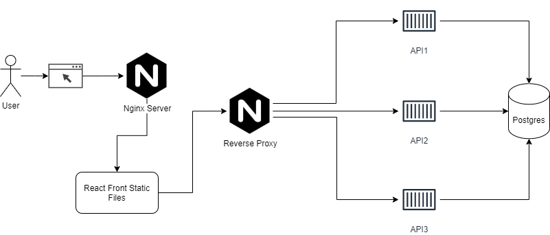

# Student App

Um projeto para gerenciar estudantes, onde é possível incluir e buscar pelos seus respectivos campos. O requisitos era que fosse desenvolvido uma api com GraphQL e um front utilizando ReactJS.

## Rodando o projeto

### Pré-requisitos
Antes de começar, você vai precisar ter instalado em sua máquina as seguintes ferramentas:
[Git](https://git-scm.com) e [Docker](https://www.java.com/pt-BR/)

### Clonando o projeto

Clone o projeto

```bash
  git clone https://github.com/mauriciofragajr/student-application.git
```

Vá até o diretório

```bash
  cd student-application
```

Copie o arquivo .env.example e crie o seu .env

```bash
  cp .env.example .env
```
Separei os ambientes em dois docker-compose. Onde o de desenvolvimento permite um recarregamento automático em toda a alteração do código, enquanto o de produção está otimizado e pronto para levar a um ambiente produtivo.

#### Executando em produção

Inicie os serviços com o docker-compose.
Rode com o o parâmetro -d para que seja executado em segundo plano, ou sem ele para ver os logs dos containers.

```bash
  docker-compose up -d
```

Se tudo estiver correto o webapp estará rodando na porta 8080 do [localhost:8080](http://localhost:8080)

#### Executando em desenvolvimento

Executando o comando a seguir você levanta os containers utilizando o modo desenvolvimento. Você conseguirá os logs em tempo real conforme for alterando o código.

```bash
  docker-compose -f docker-compose.development.yml up
```

Se tudo estiver correto o webapp estará rodando na porta 8080 do [localhost:8080](http://localhost:8080)

## Arquitetura

A arquitetura do software está representada na imagem a seguir



O projeto é composto por: banco de dados, api, front e proxy reverso.

#####  Banco de dados
Este componente é usado para a persistência dos dados da aplicação. Foi escolhido o postgres pela sua alta performance e compatibilidade com diversas linguagens. Além da enorme quantidade de informações e documentação sobre.

##### Api
Este componente é o responsável por criar uma interface com o padrão graphQL com interoperabilidade. Utilizei o NestJS pela configuração pré-definida do typescript e configuração do ambiente para desenvolvimento. Além de ser um framework muito utilizado pela comunidade e com uma ótima documentação.
Escolhi esse framework por seguir alguns padrões de projetos bem conhecidos e de fácil customização para que não fiquemos refém dele.
Somente esse componente faz acesso ao banco de dados, deixando de forma abstraída para o front onde e como está sendo persistido os dados.

##### Front
Componente responsável pela interface gráfica onde os usuários terão acesso às funcionalidades do sistema. Para manter o padrão das escolha da linguagem, optei por iniciar o projeto com create-react-app com typescript. Nele também usei o Apollo para a integração com o backend feito com graphQL.
Foi configurado cache para as requisições idênticas no front, e isso aumenta muito a performance do sistema como um todo.

##### Proxy reverso
Implementei um simples proxy reverso para as requisições no backend utilizando o escalonamento Round-Robin. Como default estou escalando manualmente 3 vezes a API para fazer esse balanceamento de requisições. Com esse serviço é possível definir diversas configurações de acesso simultâneo, cache, entre outros.

## Testes automatizados

Para executar os testes unitários da api basta ir até a pasta

```bash
  cd api
```

E executar o comando

```bash
  npm run test
```

## 🛠 Tecnologias
As seguintes tecnologias foram usadas na construção do projeto:

- [Nest](https://nestjs.com/)
- [GraphQL](https://graphql.org/)
- [Apollo](https://www.apollographql.com/)
- [React](https://pt-br.reactjs.org/)

## Autor
Jose Mauricio

[](https://www.linkedin.com/in/mauriciofragajr/) 
[](mailto:mauriciofragajr@gmail.com)